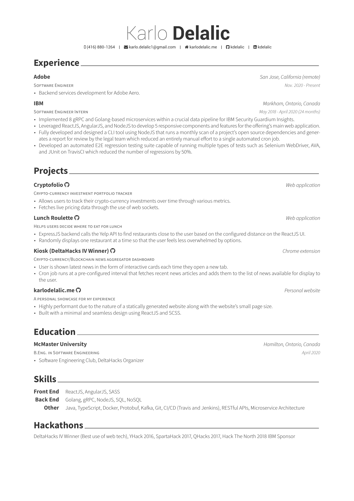

# auto-resume [](https://travis-ci.org/kdelalic/auto-resume)

Each new git tag automatically generates a release with `resume.pdf`, pushes `resume.png` to master for preview in the readme, and triggers a Netlify build hook that pushes the new `resume.pdf` to <https://karlodelalic.me/resume.pdf>.

## Setup

1. Fork this repo.
2. Enable [TravisCI](https://travis-ci.org/) for the forked repo.
3. [Create a Personal Access Token](https://github.com/settings/tokens) and add it to your TravisCI job's environment variables as `GITHUB_TOKEN`.
4. Edit `travis-push.sh` to point to your forked repo.
5. Add your resume tex files to the `src` directory (Make sure your main file is named `resume.tex`).
6. Edit the `after_deploy` Travis phase in `.travis.yml` to include any hooks that need to be called on success (i.e. My job calls a Netlify build hook which pushes my resume to my personal website, see more [here](https://github.com/kdelalic/karlodelalic.com-gatsby/blob/master/build.sh)).

## Usage

1. Make changes to your tex files.
2. Push your changes to the `master` branch.
3. Create a new git tag (`git tag v1.0.0` and then `git push origin v1.0.0`)
4. Your resume should be released on Github once the Travis build passes.
5. Download the latest release by executing the following command (this can be useful if you want to pull the latest release in a different repository through a build process):

    ```bash
    curl -s https://api.github.com/repos/kdelalic/auto-resume/releases/latest \
    | grep "browser_download_url" \
    | cut -d : -f 2,3 \
    | tr -d \" \
    | wget -i -
    ```

## Preview


