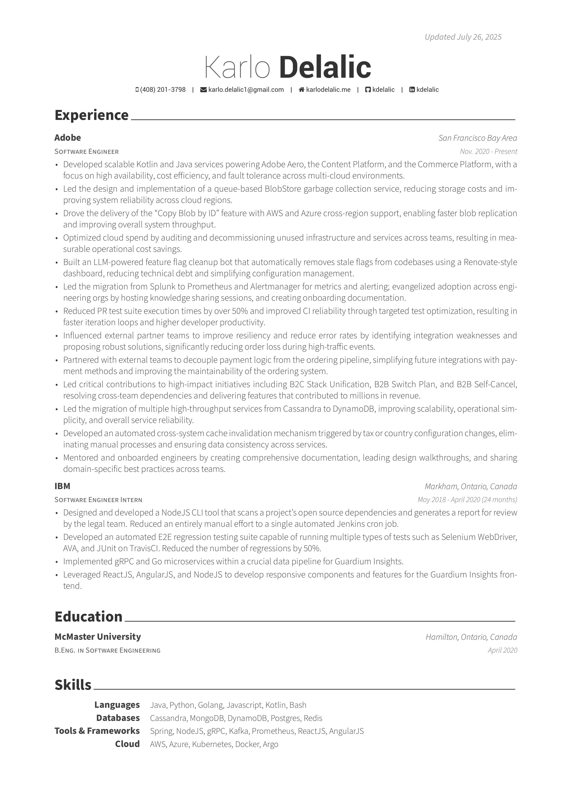

# auto-resume 


Each new git tag (release) automatically generates a release with `resume.pdf`, pushes `resume.png` to master for preview in the readme, and triggers a Netlify build hook that pushes the new `resume.pdf` to <https://karlodelalic.me/resume.pdf>.


## Setup

1. Fork this repo.
2. Add your resume tex files to the `src` directory (Make sure your main file is named `resume.tex`).
3. In your forked repo, go to **Settings → Secrets and variables → Actions** and add your Netlify build hook URL as a secret named `NETLIFY_BUILD_HOOK` (if you want to trigger a Netlify build).
4. (Optional) Update the workflow file at `.github/workflows/ci.yml` if you need to customize the build or deploy steps.


## Usage

1. Make changes to your tex files.
2. Push your changes to the `master` branch.
3. Create a new GitHub Release (either via the GitHub UI or by pushing a new tag and creating a release):
    - Tag your commit: `git tag v1.0.0`
    - Push the tag: `git push origin v1.0.0`
    - Go to the GitHub Releases page and publish a new release for the tag.
4. Your resume will be released on GitHub once the GitHub Actions workflow completes.
5. Download the latest release by executing the following command (this can be useful if you want to pull the latest release in a different repository through a build process):

    ```bash
    curl -s https://api.github.com/repos/kdelalic/auto-resume/releases/latest \
    | grep "browser_download_url" \
    | cut -d : -f 2,3 \
    | tr -d \" \
    | wget -i -
    ```


## Preview


